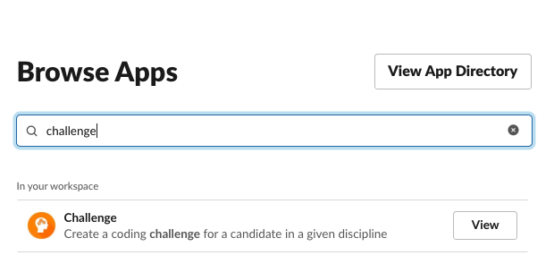
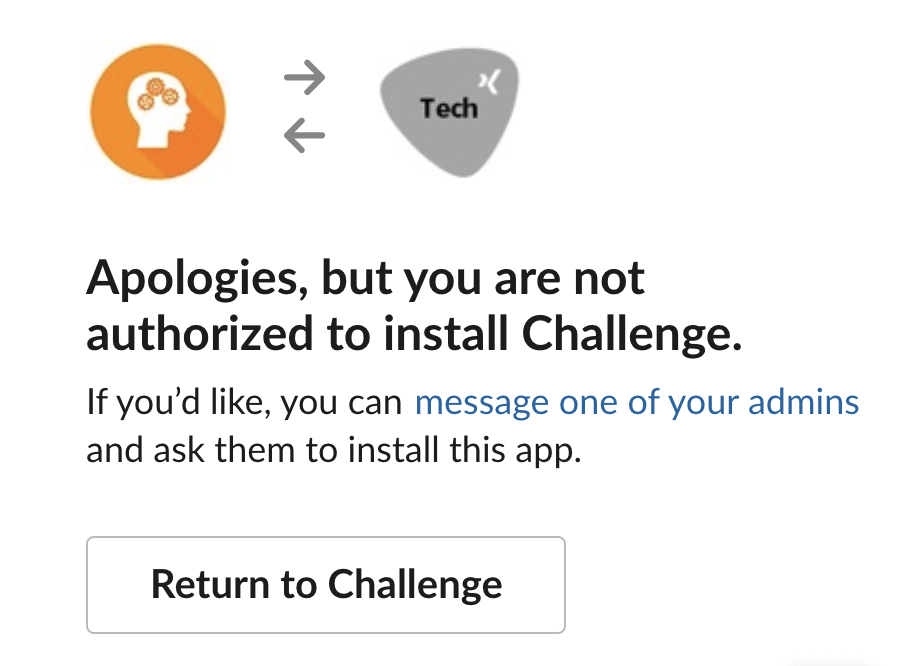
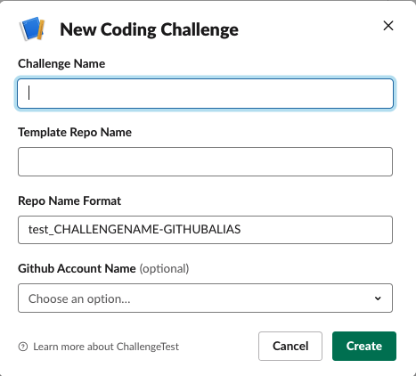
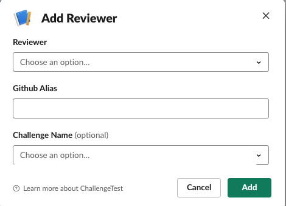
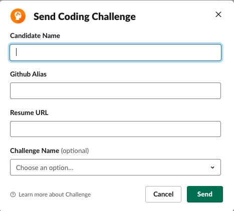

# Coding Challenge App

You can use this app to manage coding challenges that you send to candidates. It is both a Slack App and a Github App. It integrates into Slack to allow anyone to register a new coding challenge and send a coding challenge to a candidate using a Slash command - `/challenge`. It integrates into your Github repository, so that you can create a new private repository per candidate from a coding challenge template repository. For each coding challenge sent, it also creates a Github issue in the coding challenge template repository to track the active challenges.

Below you will find sections on:

* How to use on a daily basis 
* How to set it up for your own Slack environment and Github accounts (organization or self owned)
* How to contribute to it

## Quick Start
If everything is already setup for you (as described in following stages), and all you want to do is to send a coding challenge to someone, then just jump to this [section](#Send-a-coding-challenge).

## Usage
This section assumes that you have setup this application either [yourself](#Self-Host-Setup) or somebody else did it for you and you want to use it in your Slack workgroup. (Note that this app is currently not available for use publicly, it is still in development, but you can try self hosting it.)

### Register the Challenge Github App in your Github Account
You can use any Github account (personal or organization) to create challenge repositories. Personal accounts can have unlimited private accounts but they come with the restriction of having up to 3 contributors/repository only. This app always creates the challenge repositories as private repositories since you most likely don't want other candidates to see each other's code.

Before you can use your Github account, you need to install this app to your account. You will either get a link to install this app (because somebody else is doing the hosting and sent you the link), or you are self hosting this app as your own private app. Either case you need to register this app to your Github account to be able to start using it. 


Once you install it (by clicking on the link on the provided URL), the app should be seen as below in your Github account:


The app installation will take you to a next step, where you need to also authorize the application as a user - please also accept the authorization and once you do, it should show like below:


### Register the Challenge App in Slack
You also need to register the app in your Slack workspace to start using the / commands from Slack. 

Below is how you can add the app to your workspace:



Keep in mind that your Slack organization administrator might have disabled installing apps except for users with admin privileges. In that case you will get an error like below:



In that case, you need to ask your admininstrator to install the app for you to your Slack workgroup. You will need to send the following link to start the installation flow as the Slack app is not available in the directory of Slack apps.

```
http://YOURDOMAIN.WHERE.THIS.RUNS/auth/slack/install.html
```

### Create a new challenge template in Github
In order to start the process, you need to first create a repo that contains your challenge template in the Github account you registered the app with - [see previous section](#Register-the-Challenge-Github-App-in-your-Github-Account). In the repo you can include anything you want as a starter for the challenge. This repo will then be replicated for the candidate as a starter one. Also you would want to make this repo a private one.

Below is an example template:


### Register the challenge template
Before sending a new challenge, you need to register the challenge template into the database. To do that you will need to type in the below: (We recommend you to create a specific Slack channel for all the coding challenges you will be sending. If there are multiple challenges for different positions, it is better to create different channels for each in Slack)

* Go to your Slack channel and type:

```
  /challenge new
```

* You will be presented by the below dialog:



* In the above dialog:
  * *Challenge Name* Give a user friendly and unique name to the challenge, you will be using this later to pick a template for the challenge.
  * *Template Repo Name* The name of the Github Challenge Template Repo that you have registered before. E.g. challenge_temp1 from the [previous screenshot](Create-a-new-challenge-template-in-Github)
  * *Repo Name Format* You can specify a naming format for repos that the tool will be creating for the candidates. The default is already populated so you can either keep it or modify it. Use `CHALLENGENAME` as a placeholder for the name of the challenge and `GITHUBALIAS` as a placeholder for the candidate's github alias.
  * *Github Account Name* Specify the Github account the challenge repos (and their templates) will be (are) stored.  
* And once you are comfortable tap `Create` button. This will register the coding challenge template.

### Edit the challenge template
You can also edit the challenge template you created.

* Go to your Slack channel and type:

```
  /challenge edit CHALLENGENAME
```

* You will be presented by the below dialog:


And edit as in new registration.

### Register a reviewer
You can register reviewers to review coding challenges. In order to do that:

* Go to your Slack channel and type:

```
  /reviewer new
```

* You will be presented by the below dialog:



* In the above dialog:
  * *Reviewer* From the drop-down select the name of the reviewer you like to register
  * *Github Alias* Type in the github alias for the reviewer
  * *Challenge Name* Select from the drop-down the challenge name the reviewer will be able to review.
  * *Technology List* Add a comma delimited list of languages/technologies which the reviewer can evaluate. E.g. ruby,elixir 
  * *Experience Level* Select the interviewing experience level of the reviewer. This goes from low, mid, high.
  * *Bookings per Week* Select the maximum number of bookings per week allowed.

### Edit the reviewer
You can edit the reviewer information. 

* Go to your Slack channel and type: (if you omit the @SLACKID, then you will be editing your own information)

```
  /reviewer edit @SLACKID
```

* You will be presented by the below dialog:


*IMPORTANT* Keep in mind that currently due to the limitation in Slack App, Challenge App needs to be filled in, again otherwise it will overwrite the existing with no value.

### Edit the reviewer schedule

* Go to your Slack channel and type: (if you omit the @SLACKID, then you will be updating your own schedule)

```
  /reviewer schedule @SLACKID
```

* You will be presented by the below dialog:


* You can pick the below options for the week of the year.
  * *All Weeks* Means you will be setting your schedule for all weeks in the year. Unless you override this for a specific week, this will be your default schedule.
  * *Week X - Month Day - Month Day* This options lets you override your default schedule for that given week.

Once you pick an option, Slack will show you a grid of buttons to pick from:


You tap/click on a button to toggle your availability for that slot. In the above example, the reviewer is available for ` Thursday: 16:30-18:30 ` slot

### Find reviewers for a given week

* Go to your Slack channel and type: 

```
  /reviewer find
```

* You will be presented by the below dialog:


* In the above dialog:
  * *Week of the Year* Specify which week you are looking the reviewers for.
  * *Day of Week* Specify which day of the week you are looking the reviewers for.
  * *Challenge Name* From the drop down menu, specify the name of the challenge the reviewers registered for.
  * *Technology List* Specify the technology the reviewers can review the challenge for. (E.g. ruby, java ...)

And based on the search parameters, you will get all available reviewers for that day of that week: (and pressing book/unbook button you can do the booking.)


  
### Show all bookings of a reviewer

* Go to your slack channel and type: (if you omit the @SLACKID, then you will be seeing your own bookings)

```
  /reviewer bookings @SLACKID
```

* This will give the following response where you can update their booking info:


### Send a coding challenge
In order to send a coding challenge, you can type in the below: (We recommend you to create a specific Slack channel for all the coding challenges you will be sending. If there are multiple challenges for different positions, it is better to create different channels for each in Slack)

* Go to your Slack channel and type:

```
  /challenge send (optional ChallengeName)
```

* You will be presented by the below dialog:



* In the above dialog:
  * *Candidate Name* Type in the full name of the candidate so that you can identify them later.
  * *Github Alias* Enter the github alias for the candidate. If this is not a valid alias, the challenge will not be created. This needs to be the github alias (name) and -not- their email address.
  * *Resume URL* Type in the URL for the resume of the candidate. These can be links to your internal Application Tracking system or XING/LinkedIn/Github account urls. 
  * *Challenge Name* From the dropdown, pick the name of the challenge (which you have registered in the prior steps).
  * *Reviewer 1* From the dropdown, pick the name of the reviewer to review the coding challenge. The reviewers need to be registered with the system to appear in this dropdown. If you optionally specified the name of challenge, the list of reviewers will be filtered for the challange.
  * *Reviewer 2* You can add a second reviewer using this dropdown.
* And once you are comfortable tap `Create` button. This will create a new coding challenge repository, add the candidate as a collaborator (at which point Github will send an invite email) and finally create an issue for you to track the coding challenge.

You will see a summary like below:


An issue will be created automatically in the challenge template repository in Github so you track this:


You can optionally create a project in Github such as below to track the lifecycle:


## Self Host Setup


## Contribute

