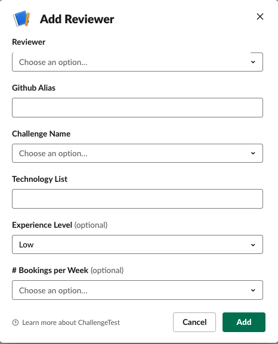
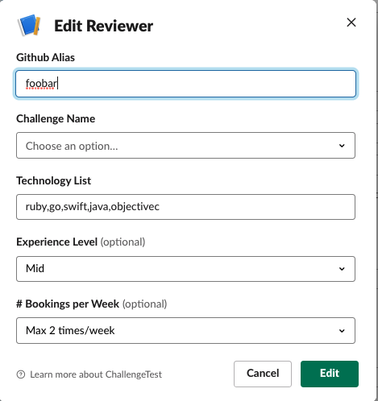
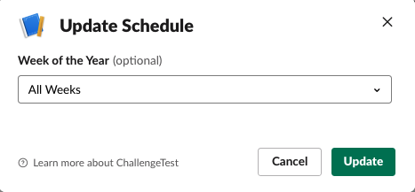
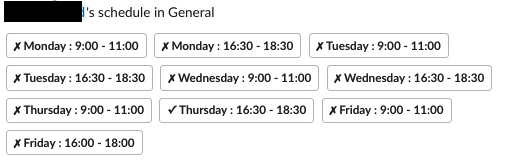

# Registering/Editing Reviewers

## Register a reviewer
You can register reviewers to review coding challenges. In order to do that:

* Go to your Slack channel and type:

```
  /reviewer new
```

* You will be presented by the below dialog:



* In the above dialog:
  * *Reviewer* From the drop-down select the name of the reviewer you like to register
  * *Github Alias* Type in the github alias for the reviewer
  * *Challenge Name* Select from the drop-down the challenge name the reviewer will be able to review.
  * *Technology List* Add a comma delimited list of languages/technologies which the reviewer can evaluate. E.g. ruby,elixir 
  * *Experience Level* Select the interviewing experience level of the reviewer. This goes from low, mid, high.
  * *Bookings per Week* Select the maximum number of bookings per week allowed.

## Edit the reviewer
You can edit the reviewer information. 

* Go to your Slack channel and type: (if you omit the @SLACKID, then you will be editing your own information)

```
  /reviewer edit @SLACKID
```

* You will be presented by the below dialog:



*IMPORTANT* Keep in mind that currently due to the limitation in Slack App, Challenge App needs to be filled in, again otherwise it will overwrite the existing with no value.

## Edit the reviewer schedule

* Go to your Slack channel and type: (if you omit the @SLACKID, then you will be updating your own schedule)

```
  /reviewer schedule @SLACKID
```

* You will be presented by the below dialog:



* You can pick the below options for the week of the year.
  * *All Weeks* Means you will be setting your schedule for all weeks in the year. Unless you override this for a specific week, this will be your default schedule.
  * *Week X - Month Day - Month Day* This options lets you override your default schedule for that given week.

Once you pick an option, Slack will show you a grid of buttons to pick from:



You tap/click on a button to toggle your availability for that slot. In the above example, the reviewer is available for ` Thursday: 16:30-18:30 ` slot
