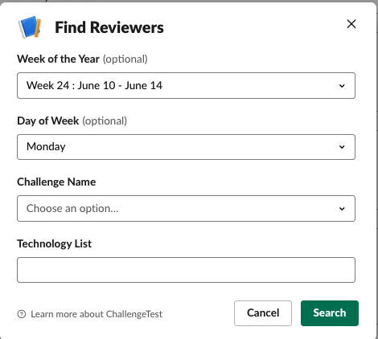

# Finding Reviewers & Bookings

## Find reviewers for a given week

* Go to your Slack channel and type: 

```
  /reviewer find
```

* You will be presented by the below dialog:



* In the above dialog:
  * *Week of the Year* Specify which week you are looking the reviewers for.
  * *Day of Week* Specify which day of the week you are looking the reviewers for.
  * *Challenge Name* From the drop down menu, specify the name of the challenge the reviewers registered for.
  * *Technology List* Specify the technology the reviewers can review the challenge for. (E.g. ruby, java ...)

And based on the search parameters, you will get all available reviewers for that day of that week: (and pressing book/unbook button you can do the booking.)


  
## Show all bookings of a reviewer

* Go to your slack channel and type: (if you omit the @SLACKID, then you will be seeing your own bookings)

```
  /reviewer bookings @SLACKID
```

* This will give the following response where you can update their booking info:


