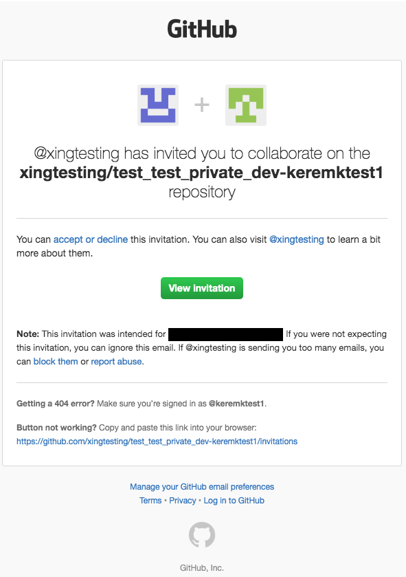
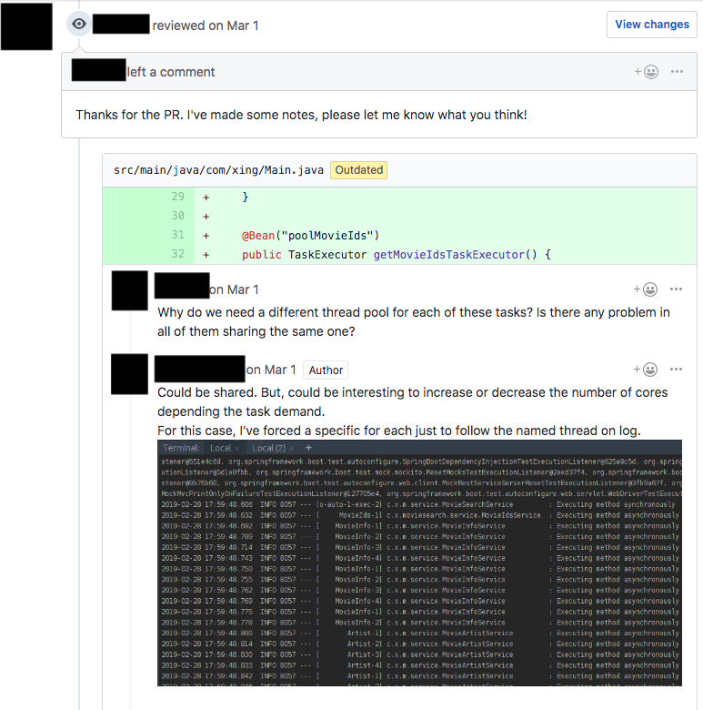

# Github Challenge Workflow

This app allows you to use Github, as part of you coding challenge process much like how you would use Github in your daily development workflow.

## Create a Challenge Template Repository
The first step is to design a coding challenge for your candidates and push it to a repository in your own (personal or organization) Github account. This starter repository will most likely (recommended) to include:

* A README file for the candidate, giving them instructions for the coding challenge.
* An optional but highly recommended rubric that explains them, how they will be evaluated on their challenge submission.
* Additional files needed such as UI mockup files, docker files for dependent services. 
* Optionally a skeletal challenge such as an empty iOS app for an iOS challenge with things that need to be implemented.

You should push this to a private repository, as you most likely won't want everybody else to see or copy your challenge.

Below is an example template:

## Register your Challenge to the Tool

Your challenge needs to be registered to the challenge app. In order to do that please follow the instructions in the [Registering/Editing A Challenge](register-challenge.md) section.

## Send the Challenge to The Candidate

Now you are ready to send the coding challenge to the candidate. In order to do this, please follow the instructions in the [Quickstart - Sending Coding Challenges](quickstart.md) section.

## Candidate Receives Invite from Github

The candidate will receive an email from Github, inviting them to the coding challenge. Below is a sample email:

## The New Challenge Repo is Added for Tracking

The tool creates a new challenge repo from the template you provided with the naming convention you setup. 

An issue will be created automatically in the challenge template repository in Github so you track this:

You can optionally create a project in Github such as below to track the lifecycle:

## Candidate Sends a PR and Discussion

The candidate when ready sends their PR and you can have a discussion with the candidate to iterate on the challenge submission. This allows you to have an asynchronous conversation with the candidate and prevents early elimination so you can clear your doubts and see how the candidate responds to your feedback.

Below is a sample PR conversation:

