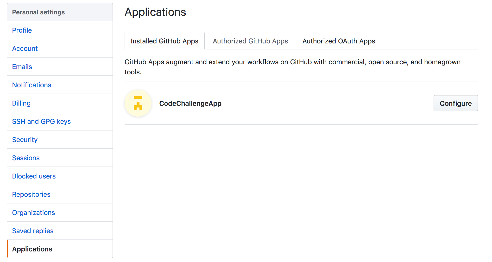
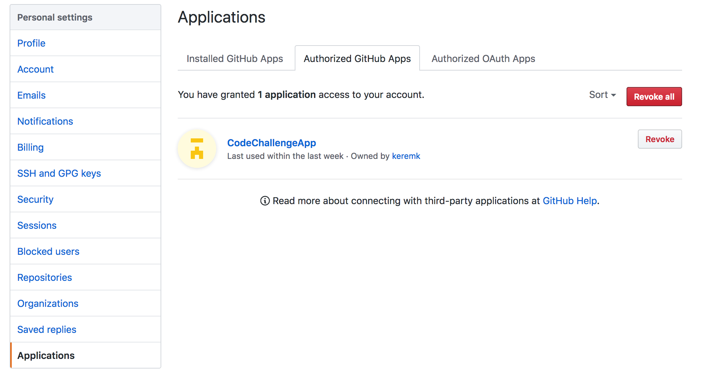

# Installation

You can skip this section if the app is already installed to your Github and Slack accounts.

## Register the Challenge App in Github

You can use any Github account (personal or organization) to create challenge repositories. Personal accounts can have unlimited private accounts but they come with the restriction of having up to 3 contributors/repository only. This app always creates the challenge repositories as private repositories since you most likely don't want other candidates to see each other's code.

Before you can use your Github account, you need to install this app to your account. You will either get a link to install this app (because somebody else is doing the hosting and sent you the link), or you are self hosting this app as your own private app. Either case you need to register this app to your Github account to be able to start using it. For self hosted case, the link will be here: (you need to be logged into to your Github account with admin privileges)

```
http://YOURDOMAIN.WHERE.THIS.RUNS/auth/github/install.html
```

Once you install it (by clicking on the link above), the app should be seen as below in your Github account:



The app installation will take you to a next step, where you need to also authorize the application as a user - please also accept the authorization and once you do, it should show like below:



## Register the Challenge App in Slack

You also need to register the app in your Slack workspace to start using the / commands from Slack. 

If you have access rights to install apps in your workspace then you can install the app yourself, otherwise you need permissions from your admin or your admin installs this for you.

If you have the access rights, below is how you can add the app to your workspace:

You will need to use the following link to start the installation flow as the Slack app is not available in the directory of Slack apps. (The link below is for self-hosted version of Challenge App)

```
http://YOURDOMAIN.WHERE.THIS.RUNS/auth/slack/install.html
```

Keep in mind that your Slack organization administrator might have disabled installing apps except for users with admin privileges. In that case you will get an error like below:


In that case, you need to ask your admininstrator to install the app for you to your Slack workgroup. You will need to send the above link to your administrator.
