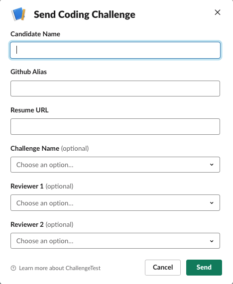
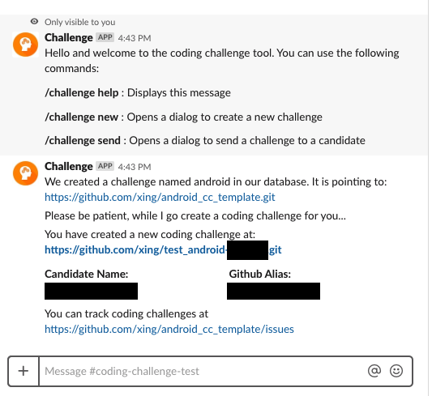

# Quickstart

If everything is already setup for you (as described in following stages), and all you want to do, is to send a coding challenge to a candidate, then this page is the only page you need to read!

### Send a coding challenge
In order to send a coding challenge, you can type in the below: (We recommend you to create a specific Slack channel for all the coding challenges you will be sending. If there are multiple challenges for different positions, it is better to create different channels for each in Slack)

* Go to your Slack channel and type:

```
  /challenge send (optional ChallengeName)
```

* You will be presented by the below dialog:



* In the above dialog:
  * *Candidate Name* Type in the full name of the candidate so that you can identify them later.
  * *Github Alias* Enter the github alias for the candidate. If this is not a valid alias, the challenge will not be created. This needs to be the github alias (name) and -not- their email address.
  * *Resume URL* Type in the URL for the resume of the candidate. These can be links to your internal Application Tracking system or XING/LinkedIn/Github account urls. 
  * *Challenge Name* From the dropdown, pick the name of the challenge (which you have registered in the prior steps).
  * *Reviewer 1* (Optional) From the dropdown, pick the name of the reviewer to review the coding challenge. The reviewers need to be registered with the system to appear in this dropdown. If you optionally specified the name of challenge, the list of reviewers will be filtered for the challange.
  * *Reviewer 2* (Optional) You can add a second reviewer using this dropdown.
* And once you are comfortable tap `Create` button. This will create a new coding challenge repository, add the candidate as a collaborator (at which point Github will send an invite email) and finally create an issue for you to track the coding challenge.

You will see a summary like below:



